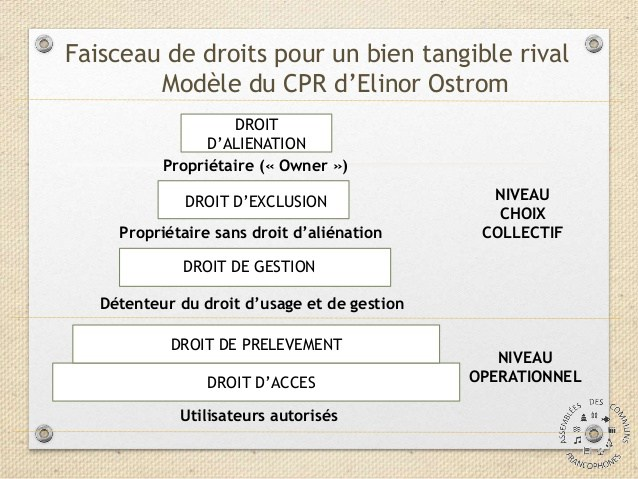

## Faisceau de droits (communs)

pour un bien tangible rival (modèle du CPR d'Elinor Ostrom)

Niveau choix collectif

- Droit d'aliénation - propriétaire ("owner")
- droit d'exclusion - propriétaire sans droit d'aliénation
- droit de gestion - détenteur du droit d'usage et de gestion

Niveau opérationnel

- Droit de prélèvement
- Droit d'accès

Le droit d’aliénation constitue le sommet de la pyramide du faisceau de droits selon Ostrom et il correspond à l’attribut suprême du propriétaire – l’abusus du droit romain – permettant à celui qui le détient de donner, de vendre ou de détruire un bien. 

Source:

https://scinfolex.com/2016/05/11/en-quoi-la-bibliodebout-constitue-t-elle-un-commun/

interessant à lire pour voir la lecture de bibliodebout sous la lunette du faisceau des droits.
